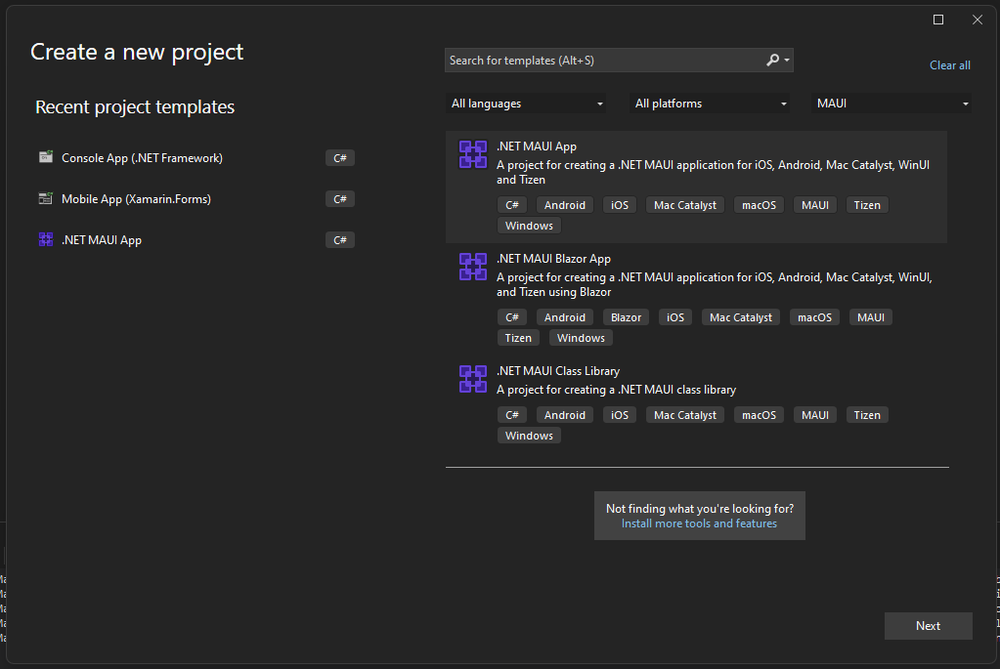
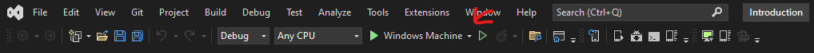
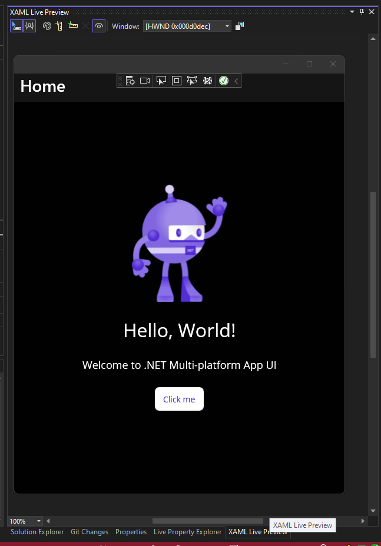
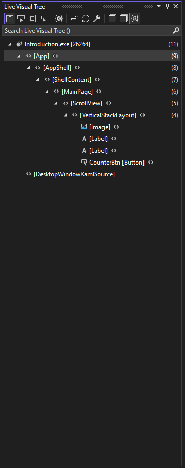

# Introduction to .NET MAUI #

.NET Multi-platform App UI (.NET MAUI) is a cross-platform framework for creating native mobile and desktop apps with C# and XAML. Using .NET MAUI, you can develop apps that can run on Android, iOS, macOS, and Windows from a single shared code-base.

## Prerequisites ##

### Windows ###
* Installation of Visual Studio 2017 for Windows with Xamarin [[instructions](https://learn.microsoft.com/en-us/visualstudio/install/install-visual-studio?view=vs-2022)]
* Installation of GitHub Desktop Client [[instructions](https://desktop.github.com/)]
  (You can use whatever client you are familiar with.)
* Update Visual Studio 2017 for Windows [[instructions](https://learn.microsoft.com/en-us/visualstudio/install/update-visual-studio?view=vs-2022)]

### macOs ###
* Installation of Visual Studio for Mac [[instructions](https://learn.microsoft.com/en-us/visualstudio/mac/installation?view=vsmac-2022)]
* Installation of GitHub Desktop Client [[instructions](https://desktop.github.com/)]
* Update Visual Studio for Mac [[instructions](https://learn.microsoft.com/en-us/visualstudio/mac/update?view=vsmac-2022)]

### RandomUser API ###
Documentation:  [[here](https://randomuser.me/documentation)]

## Step 0 - New Project ##
Create new Solution with .NET MAUI Template

1. Open Visual Studio
2. Open Menu `File > New > Projects`
3. Select `MAUI` from the `Project types` drop-down filter
4. Select Template `.NET MAUI App`

4. Enter the name for project your project (i.e. `Maui.Introduction`)
5. Click the `Next` button
6. Select `.NET 6.0 (Long Term Support)` from the Framework drop-down
7. Click the `Create` button

## Step 1 - Run your Application ##
Make sure that your application is running.

1. Click on the drop-down next to `Windows Machine`

2. Select the emulator, simulator, or physical device that best suites your needs
3. The application should compile, deploy, and run in debug mode on your selection

### Step 1.1 - XAML Live Previewer ###

1. Open the `MainPage.xaml` file by double-clicking on it in your project under `Solution Explorer`
2. Select the `XAML Live Preview` tab on the bottom right pane of the `Solution Explorer` pane

3. Move your mouse over different elements
4. Watch as they are highlighted and a tooltip appears with details about the element
5. Click on one to move to that element inside of the `MainPage.xaml` screen

### Step 1.2 - Live Visual Tree ###

1. Expand the `Live Visual Tree` view on the left side of the screen by clicking on it

2. Mouse over elements listed there to see them highlight on the XAML Live Previewer (You may need to expand the elements. You may also need to pin the view open to keep it open.)
3. Click on elements in tree for them to highlight on the XAML page

### Step 1.3 - Hot Reload ###

1. Go to the label that reads `Hello, World!`
2. Change the `Text` attribute to read `Hello, North Dallas Developer Group`
3. Watch as it changes live on the XAML Live Preview and in the simulator
4. Change the `FontSize` to fit it better on your screen

## Step 2 - Create a View Model ##

1. Expand the `Dependencies` tree under the project in your `Solution Explorer`
2. Take not of the different .NET frameworks listed there
3. Right-click the `Dependencies` item and select `Manage NuGet Packages`
4. Type `CommunityToolkit` into the `Search` box
5. Select `CommunityToolkit.Mvvm` and click `Install` on the right to download the latest stable release
6. Select `CommunityToolkit.Maui` and click `Install` on the right to download the latest stable release
7. Wait for the installation to complete
8. Right-click the project item in the `Solution Explorer` and select `Add > New Folder`
9. Rename this folder to `ViewModels`
10. Now right-click this new folder and select `Add > Class`
11. Enter the name for the class as `MainViewModel.cs` and press the `Add` button
12. In the new class, change the class signature inherit from `ObservableObject` and make the class `public`
``` C#
public sealed class MainViewModel : ObservableObject
```

### Step 2.1 - Create View Model Properties ###
We'll create a count property to track the number of clicks performed by the user. We are separating it from the UI.

1. Add a `Count` property to `MainViewModel` that uses `SetProperty` notify the UI that the property has changed
``` C#
private int? _count;
public int? Count
{
    get => _count;
    set => SetProperty(ref _count, value);
}
```
2. Right-click `ObservableProject` and select `Go to Definition` and look at the different `SetProperty` methods
3. Right-click `INotifyPropertyChanged` and select `Go to Definition` and look at the event `PropertyChanged`

### Step 2.2 - Create View Model Command ###
Let's create a command. This will replace our event handler to increment the count.

1. Add an `IncrementCountCommand` property to the `MainViewModel`
``` C#
public ICommand IncrementCountCommand { get; }
```
2. This much be public, so it can bind to the page
3. Create a method that will increment the count
``` C#
private void IncrementCount()
{
    Count = Count + 1 ?? 1;
}
```
4. Now create a constructor to initialize the command and use the method
``` C#
public MainViewModel()
{
    IncrementCountCommand = new Command(IncrementCount);
}
```

### Step 2.3 - Binding the View Model to the View (or Page) ###
Now that we have a logic separated into a view model, let's bind it to the view so that the user can interact with it.

1. Open `MainPage.xaml`
2. Find `ContentPage` element
3. Add a `DataType` attribute to the element. This will tell the compiler what to expect for a `BindingContext` and prevent the developer from binding to properties and commands that don't exist.
``` XML
<ContentPage xmlns="http://schemas.microsoft.com/dotnet/2021/maui"
             xmlns:x="http://schemas.microsoft.com/winfx/2009/xaml"
             x:Class="Introduction.MainPage"
             x:DataType="viewModels:MainViewModel">
```
4. The `viewModels:` works like a namespace reference and lets the XAML know where to look for `MainViewModel`
5. Let's add a XML namespace reference to tell the XAML what `viewModels:` means
``` XML
<ContentPage xmlns="http://schemas.microsoft.com/dotnet/2021/maui"
             xmlns:x="http://schemas.microsoft.com/winfx/2009/xaml"
             xmlns:viewModels="clr-namespace:Introduction.ViewModels"
             x:Class="Introduction.MainPage"
             x:DataType="viewModels:MainViewModel">
```
6. Now we need to bind the `Count` property to the `Button` element
``` XML
<Button
    Text="{Binding Count}"
    SemanticProperties.Hint="Counts the number of times you click"
    HorizontalOptions="Center" />
```
7. Let's add some formatting to the text to emulate the existing code
``` XML
<Button
    Text="{Binding Count}, StringFormat='You clicked {0} time(s)'"
    SemanticProperties.Hint="Counts the number of times you click"
    HorizontalOptions="Center" />
```
8. Finally, we need to tell the XAML what do when `Count` is null
``` XML
<Button
    Text="{Binding Count}, StringFormat='You clicked {0} time(s)', TargetNullValue='Click me!'"
    SemanticProperties.Hint="Counts the number of times you click"
    HorizontalOptions="Center" />
```
9. Now that the value is being shown, we need to make the Command do work. Let's bind the command to the button.
``` XML
<Button
    Command="{Binding IncrementCountCommand}"
    Text="{Binding Count}, StringFormat='You clicked {0} time(s)', TargetNullValue='Click me!'"
    SemanticProperties.Hint="Counts the number of times you click"
    HorizontalOptions="Center" />
```
10. Get rid of all the unneeded code in the code-behind.
``` C#
namespace Introduction;

public partial class MainPage
{
	public MainPage() => InitializeComponent();
}
```

This allows you to unit test all of your business logic without having to run the application. This can be a huge time saver.

